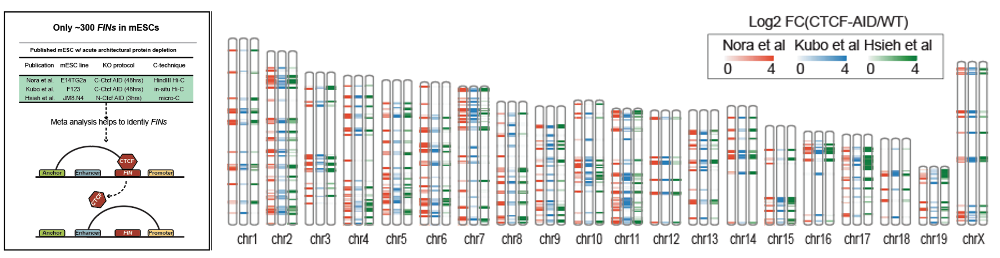
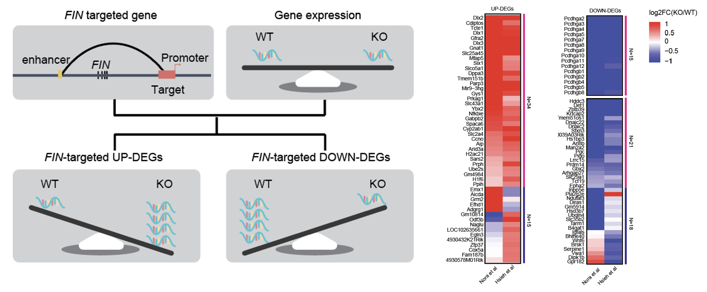
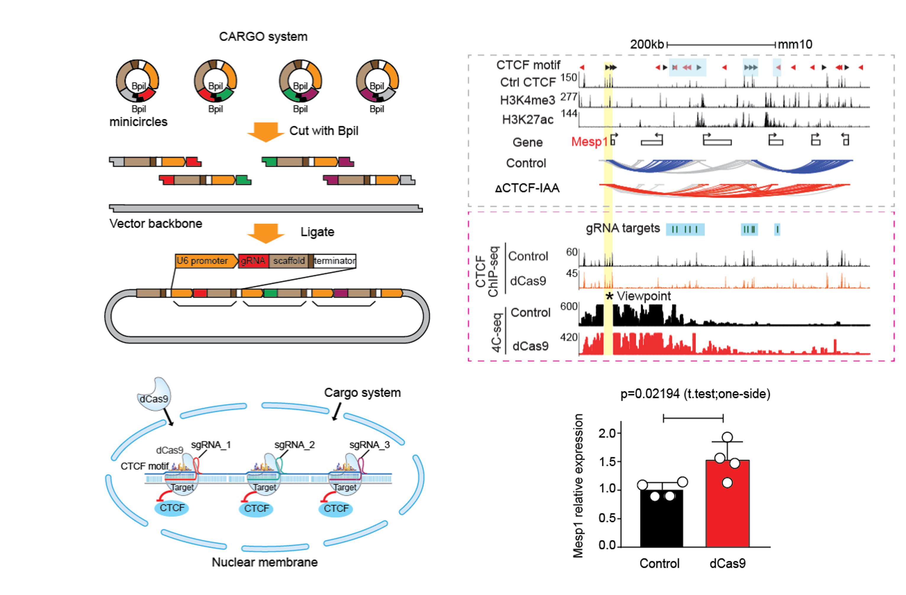
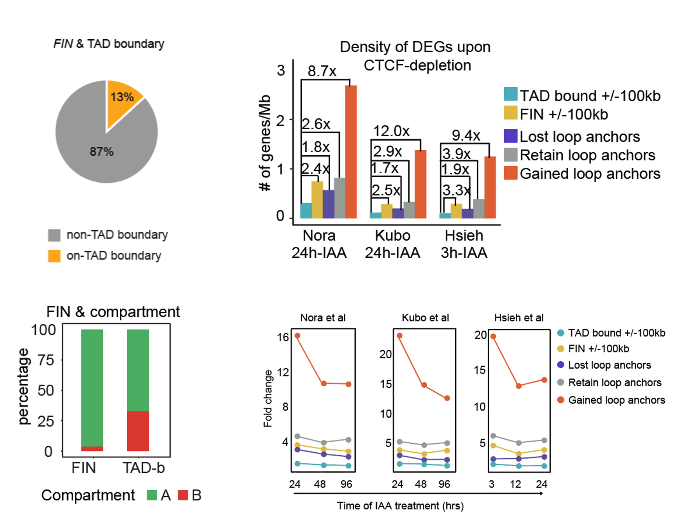
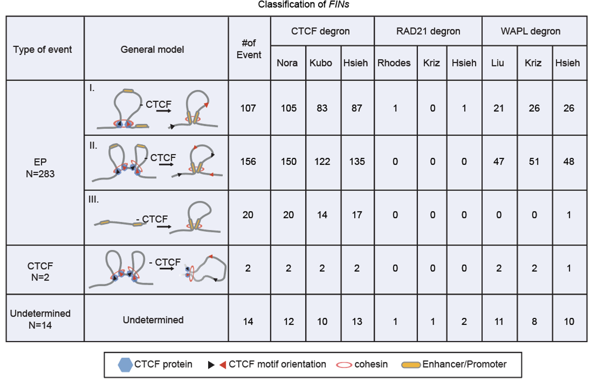

# ***FIN***: Functional insulators ctively block enhancer-promoter interactions and control gene expression.

### How does FIN looks like and how do we map them? 
It is composed of a cluster of CTCF binding sites which can block Enhancer and promoter loop (Left panel). The way we identify them is by checking if loss of these CTCF binding sites we could observe a newly created E-P loop (Right panel).

### Genome wide map of FIN in mESC.
In total, we identified ~300 FIN occurrent regions in mESCs by using cross-HiC platform meta-analysis. 

### Functionality of FIN on gene regulation.
We deciphered 103 genes which are governed by FIN. 

### Multiplexed dCas9-based CTCF displacement assay is used to validate molecular function of FINs.
By using dCas9-based CTCF displacement approach, we validated a few FINs, its insulation function and gene regulation function.

### Characterize feature of FIN.
We characterized features of FIN. 

### Mechanical way of FIN to display its function in mESC.
We classified these FINs by how they were used to block Enhancer and Promoter interaction.

