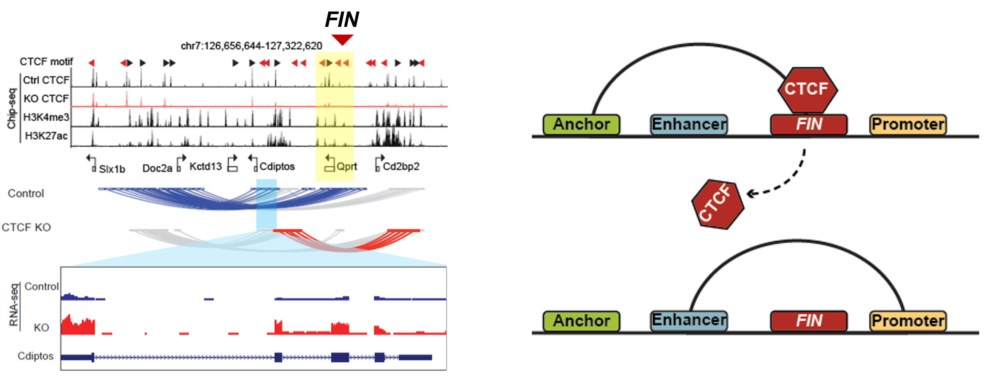

# ***FIN***: Functional insulators ctively block enhancer-promoter interactions and control gene expression.

### How FIN looks like and how we find them? 
It is composed of a cluster of CTCF binding sites which can block Enhancer and promoter loop (Left panel). The way we identify them is by checking if loss of these CTCF binding sites we could observe a newly created E-P loop (Right panel).

